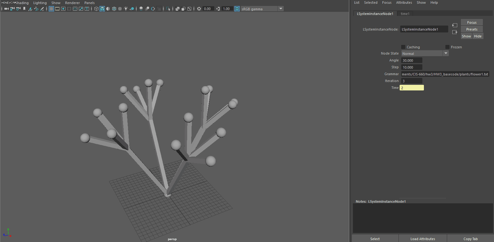
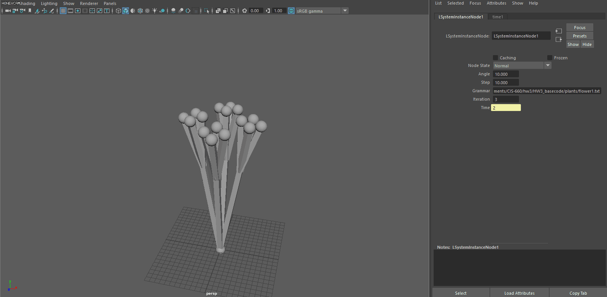
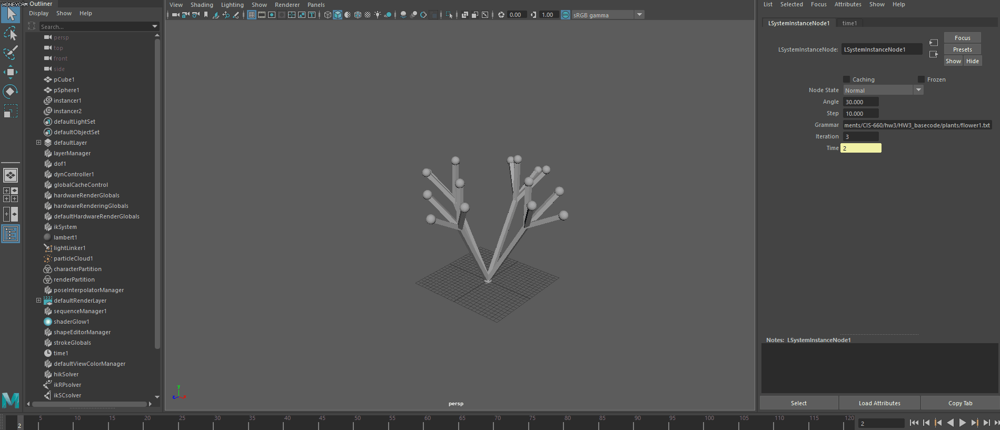
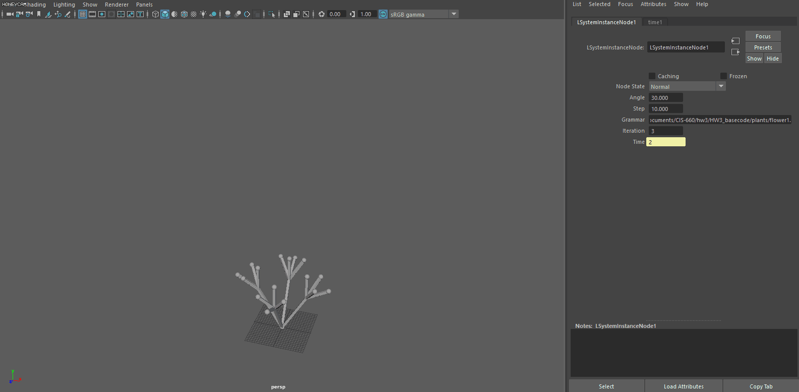

# MayaLTree
This is a L-System Maya plugin. You can set branch length and angle. Iteration is bond to time(frame number). You can also change the grammar file for shape variations.

* Branch length

* Branch angle

* Iteration

* Grammar
